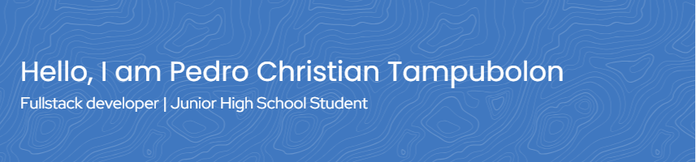

## 💫 About Me:

🔭 I’m still studying at secondary school 👯 I’m looking to collaborate on python project or website 🤝 I’m looking for help with make an app or website 🌱 I’m currently learning web development and database ⚡ Fun fact I am from Indonesia

## 🌐 Socials:

 

## ⌨️ Language:

## 💻 Operating System:

## 📊 GitHub Stats:

 
 

## 🏆 GitHub Trophies

---

